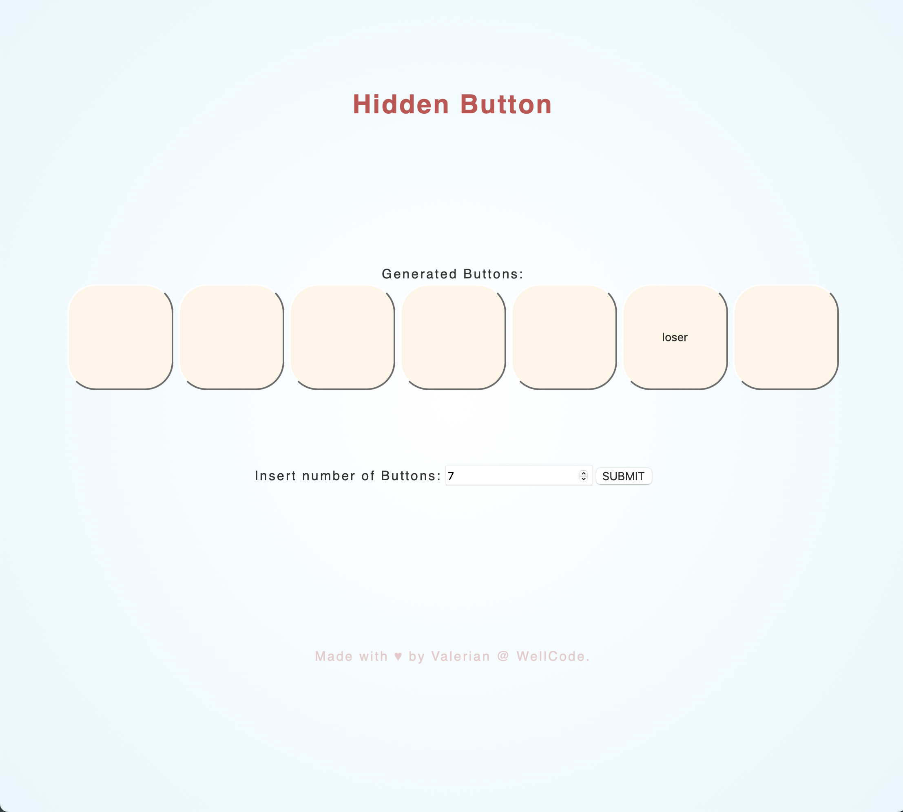

# Hidden Button

<figure style="text-align: center;">
    <picture>
        
    </picture>
    <figcaption>Screen shot of the app showing the buttons and a form 
for adding more buttons.</figcaption>
</figure>

A practice web app that implements two features:

<ul>
<li> The first feature greets the user with three buttons upon opening. Two of them are losers, and one 
is the winner, chosen randomly. The status of a button is revealed when 
the user clicks on it.</li>
<li>The second feature allows users to add a desired number of buttons 
while keeping their functionality</li>
</ul>

## How to run

To run the application, download all the files to your local machine and 
open the "index.html" file in your favorite web browser.

## Usage

The user is greeted with three buttons, and only one of them is the 
winner.
If the chosen button is the winner, it will be revealed when the user 
clicks on it.

You can change the number of buttons displayed by entering a new value in 
the form and submitting it.

Enjoy!

The content of this repository is licensed under a [Creative Commons 
Attribution License.](https://creativecommons.org/licenses/by/4.0/deed.en)

